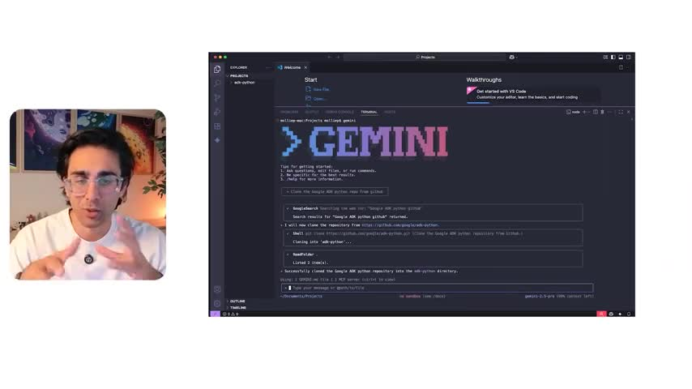
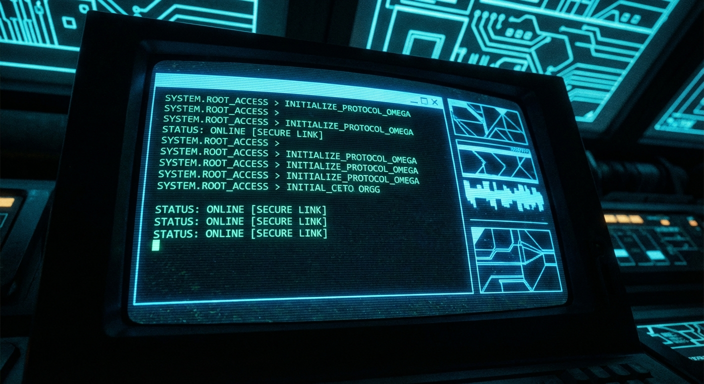

# The Future of Coding is in Your Terminal: A Deep Dive with Gemini CLI

**By Molly Pettit**

Welcome back to The Agent Factory! In our latest episode, Emmett and I had the chance to sit down with Taylor Mullin, the creator of Gemini CLI. If you’ve been following us, you know we’re huge fans of tools that actually help you get work done, and this one is a game-changer.

We talked about everything from how the project started (and almost ended!) to the philosophy behind open-source AI, and even how the tool helps build itself.

Here are my top takeaways from our chat.

## The CLI is Back

It’s funny to think that in an age of flashy web UIs, we’re circling back to the command line. Taylor shared a great story about how the project actually began a year and a half ago but was scrapped because it was "too early." Back then, it took 30 requests and a minute and a half just to get an answer.

But today? It’s a different world. Developers love the terminal because it’s where we live. As Taylor put it, "People are willing to use a CLI... and they found it as compelling as I did back then."

It’s lightweight, fast, and now, incredibly powerful.

## The Tool That Builds Itself

This was probably the wildest part of the interview for me. Taylor mentioned that Gemini CLI has written a significant amount of its own code.

He told us a story about needing a markdown renderer. Instead of finding a library, he just asked the agent, "What are my options?" The agent offered to write a parser for him. It one-shot the code, and a variant of that parser is still running in the tool today.

This concept of "self-healing" and agents fixing their own problems is huge. It’s not just about writing code; it’s about the tool understanding what it needs to function and going out to get it.

## Why Open Source Matters

We talked a lot about trust. When you have an AI agent running on your machine, reading your files, and executing commands, you need to know what it’s doing.

Taylor was really clear: "Open source is not free... but oh my gosh, it's so rewarding when you do."

By making the code visible, the team builds trust. If they make a mistake, the community sees it and helps fix it. It’s about transparency and security, ensuring that we’re all building this future together.

## The 10x vs 100x Developer

I loved this insight from Taylor:

> "With AI using AI these days, it is so easy to 10x yourself. 100x and that's the hard part."

10x is about doing your current tasks faster. 100x is about parallelizing your workflows—spinning up multiple threads, having agents work on different parts of a problem simultaneously. That’s where the real power lies.

## What’s Next?

We also got a sneak peek at the roadmap. Expect to see a lot more focus on **extensibility**. The team wants Gemini CLI to be useful for everyone, not just developers—marketers, financial analysts, you name it. You’ll be able to install extensions to customize the tool exactly for your needs.

If you haven't tried it yet, check it out on GitHub (`google-gemini/gemini-cli`). It’s definitely earned a permanent spot in my workflow.

Catch you in the next loop!
