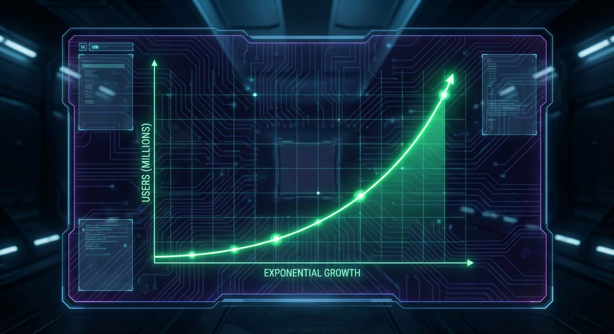
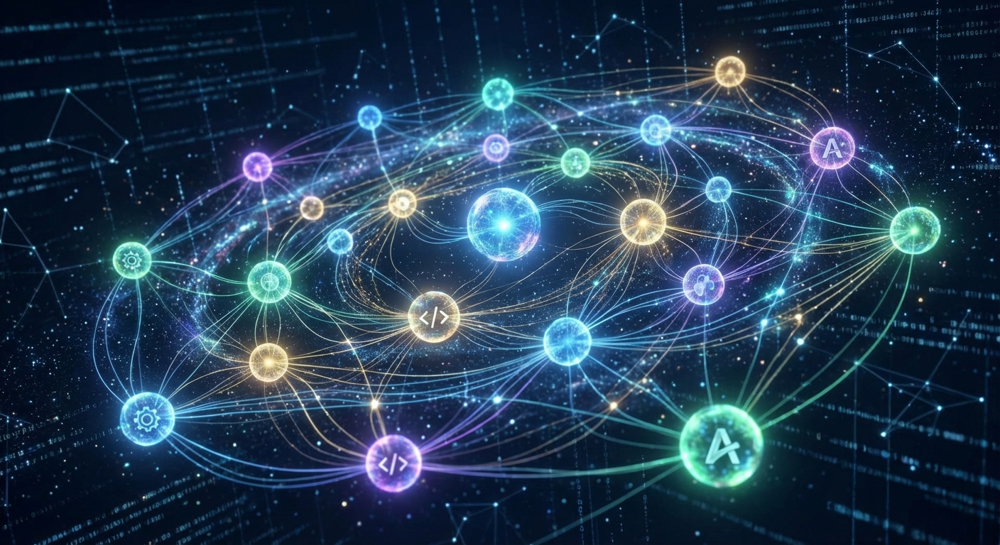

# Social Media Kit: Gemini CLI Episode

Here are four social media posts tailored for different platforms and angles, using the content from our latest episode with Taylor Mullin.

---

## Option 1: The "Thought Leader" Angle (Twitter/X & LinkedIn)
**Focus:** The difference between working faster and working smarter with AI.

**Text:**
"With AI, 10x-ing yourself is easy. The hard part? Hitting 100x." 🚀

In our latest episode of The Agent Factory, @TaylorMullin drops a truth bomb about the real power of AI agents. It's not just about typing faster—it's about parallelizing your entire workflow. 

We dive deep into how the #GeminiCLI isn't just a tool; it's a force multiplier that can even write its own code. 🤯

Catch the full deep dive here: [Link]

#AI #Productivity #DevTools #GeminiCLI #OpenSource

**Asset:**

---

## Option 2: The "Builder" Angle (Instagram/Threads)
**Focus:** The "Meta" nature of the tool building itself.

**Text:**
Ever used a tool that wrote its own code? 🤖🛠️

Taylor Mullin told us the wildest story: when building Gemini CLI, he needed a markdown parser. Instead of finding a library, he asked the agent to "one-shot" it. It wrote the parser, and that code is still running in the tool today. 

We're moving from "coding" to "architecting" faster than we think.

Check out the story in our new blog post! 🔗 in bio.

#Coding #SoftwareEngineering #AI #AgenticWorkflow #Tech

**Asset:**

---

## Option 3: The "Community & Trust" Angle (LinkedIn/Facebook)
**Focus:** Open source, security, and transparency.

**Text:**
Trust is the currency of the AI era. 🛡️

When you have an intelligent agent running on your machine, you need to know exactly what it's doing. That's why the Gemini CLI team went open source from Day 1.

"It's not free... but it's so rewarding," says creator Taylor Mullin.

By building in the open, they ensure security, transparency, and a community that helps the tool grow safer and stronger every week.

Read our full interview to see why open source is non-negotiable for the future of agents.

#OpenSource #CyberSecurity #AIethics #DevCommunity

**Asset:**

---

## Option 4: The "Teaser" Angle (General)
**Focus:** Introducing the guest and the vibe of the episode.

**Text:**
We're live! 🎙️

This week on The Agent Factory, we're sitting down with the one and only Taylor Mullin to talk all things Gemini CLI.

From his early experiments that were "too early" for the world, to shipping 150+ features a week (!!), this conversation is packed with insights for anyone building with AI.

Plus, we ask the important questions: Can Gemini CLI tell your mom you're still alive? (Spoiler: It has a plan for that). 😂

Watch now!

#Podcast #NewEpisode #TechTalk #GoogleGemini

**Asset:**

